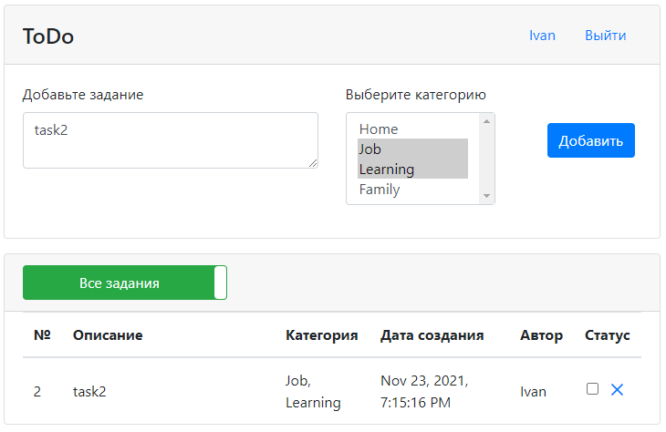

# Проект - ToDo

## О проекте

* Данное веб-приложение представляет собой сервис для работы с заданиями (таск-менеджер):
   
* Необходимо добавить описание и выбрать одну или несколько категорий задания. Для этого необходимо пройти регистрацию и авторизацию:  
   
    
   
* Ниже в таблице можно просмотреть список всех заданий. По умолчанию отображаются только невыполненные.
  Для показа всех заданий есть переключатель.
  
* Также реализована валидация всех форм приложения с помощью JS.
   
   
* Отображение списка категорий реализовано с помощью AJAX-запроса (типа POST) на сервлет CategoryServlet.
  Список категорий можно поменять.
* На страницах используется динамическое обновление контента с помощью технологии AJAX.
* Проект состоит из двух слоев: слой контроллеров (реализован на сервлетах) и слой по работе с БД PostgreSQL.
* Работа с БД осуществляется через Hibernate.
* Авторизация построена на базе фильтра (класс AuthFilter) и сервлета (класс AuthServlet).
* Для отображения авторизованного пользователя на главной странице используется AJAX-запрос на AuthServlet и объект Session.
* Работа с JSON-форматом производится с помощью библиотеки GSON.
* Страницы реализованы на HTML и Bootstrap.

## Сборка

Для сборки проекта необходимо:
1. Установить JDK 14.
2. Установить Maven.
3. Установить сервер БД PostgreSQL, задать логин - *postgres*, пароль - *password*.
4. Установить Tomcat.
5. Скачать исходный код проекта.
6. Перейти в корень проекта, где лежит файл `pom.xml`.
7. Собрать проект командой `mvn -DskipTests=true package`.
   При успешной сборке должна появиться папка target c `todo-2.war`.
8. Переименовать war-архив в `todo.war`.
9. Создать в pg_Admin БД *todo*.
10. Открыть Query Tool для созданной БД и запустить SQL-скрипт `schema.sql`,
    находящийся в папке `db`.
11. Скопировать `todo.war` в папку `webapps` Tomcat.
12. Запустить сервер с помощью `startup.bat` из папки `bin` Tomcat.

## Использование

Перейдем на главную [страницу](http://localhost:8080/todo/) приложения.

Зарегистрируемся:

Авторизуемся:

Добавим задание:

Проставим галочку в чекбоксе в столбце *Статус*, задание станет выполненым. 
Нажмем на переключатель *Невыполненные задания* для показа выполненных:

Добавим еще задание:

Удалим *task1*, нажав крестик:

## Контакты
